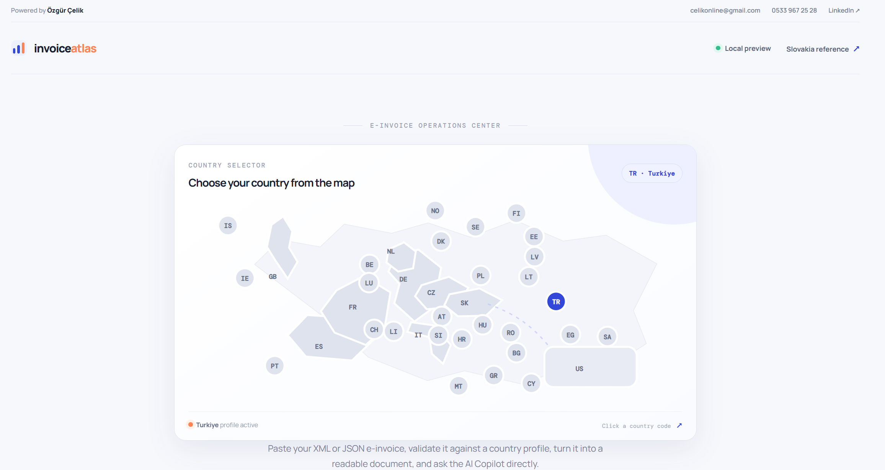
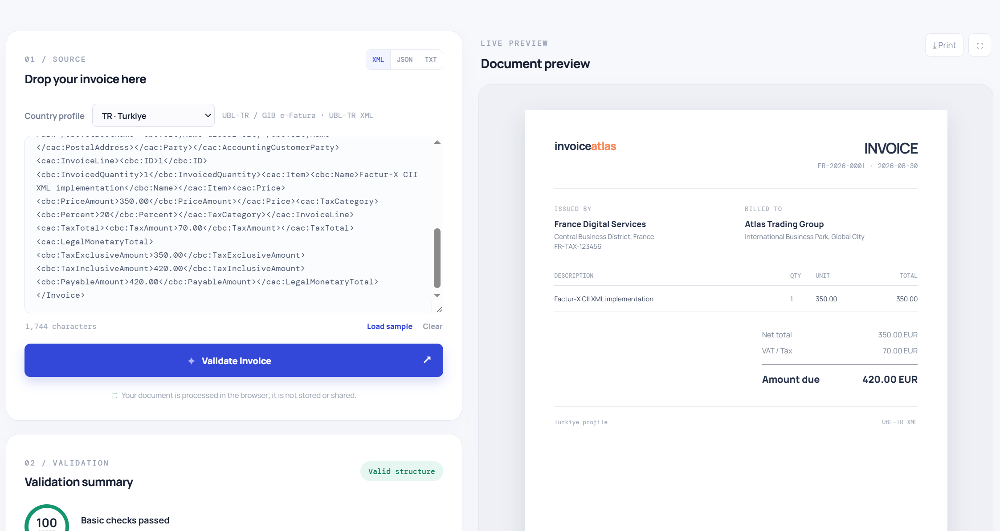
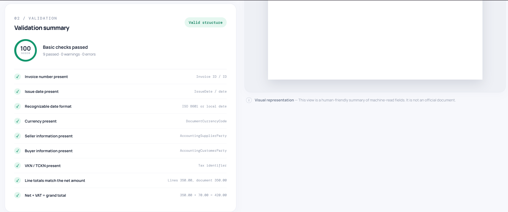
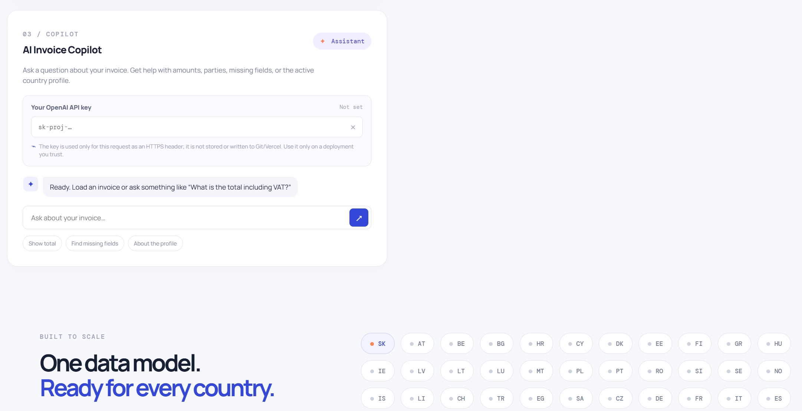

# Invoice Atlas

A country-adaptable portal for XML, JSON, and text-based e-invoice validation and visual previews.

## Portal screenshots

### Country selector



### Invoice input and document preview



### Validation summary



### AI Invoice Copilot



## Features

- Slovakia as the default profile, with core field, party, and amount checks based on EN 16931 / Peppol BIS Billing 3.0
- SK, CZ, DE, FR, IT, ES, NL, GB, US, and additional country profiles using the same canonical data model
- Parsing for XML (UBL-like), JSON, and labeled plain text
- Human-readable invoice preview with print and fullscreen support
- Optional OpenAI-powered AI Invoice Copilot with a local question-and-answer fallback when no key is configured
- Deployable with the Vercel Python runtime

## Local setup

```powershell
python -m venv .venv
.\.venv\Scripts\Activate.ps1
pip install -r requirements.txt
python api/index.py
```

Open `http://127.0.0.1:8000` in your browser. The local server runs the Starlette API and serves the frontend. For quick frontend-only development, you can also open `public/index.html` with Live Server.

## AI Copilot

Users can enter their own key in the “Your OpenAI API key” field. The key is sent in the `X-OpenAI-API-Key` header for that request only; it is not stored, logged, or written to Git/Vercel. Without a key, basic field questions use the local fallback. To use a server-owned key, add `OPENAI_API_KEY` and optionally `OPENAI_MODEL` to `.env`.

## Git and Vercel

```powershell
git init
git add .
git commit -m "Build generic e-invoice validation portal"
git branch -M main
git remote add origin <GITHUB_REPO_URL>
git push -u origin main
```

Import the repository into Vercel. Select `Other` as the framework preset if needed; `vercel.json` defines the Python API and static frontend routes. Because users can provide their own key, adding `OPENAI_API_KEY` to Vercel is optional. Users should enter keys only on deployments they trust and should never share their OpenAI API key.

> Note: This project does not provide official tax authority approval or a legal compliance decision; the validation layer is an extensible product foundation.
